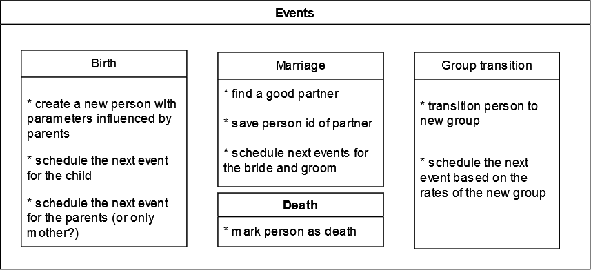

# Summary

Microsimulations of virtual populations enable a deep look into the effects of different fertility-, mortality- and marriage-rates on the structure of kinship networks and individual life events.

Socsim is a microsimulation software developed since 1973 (citation?). Since then, it has been used in many publications. It was extended continuously to serve the needs of many different demographic studies.

Although R (citation) was often used to analyze the simulation outputs, Socsim was a standalone program that only compiled with older C compilers for particular operation systems.  

We rewrote the old software and made it usable on modern operating systems. We bundled it into an easy to install R-package together with useful utility functions.

# Statement of Need

Microsimulations model the life trajectory/events and interactions of each individual in a simulation. They output the complete kinship structure of every individual in the synthetic population. This allows researchers a deep look into the effects of different scenarios on every demographic aspect of the synthetic population.  

## Simulation mechanics

### Input

Rsocsim needs an initial population as a starting point. Populations consist of a list of individuals with a defined birthdate, gender and optionally other parameters and can be read from and written to text files.

Rsocsim works with fixed length time steps. Usually one time step equals 1 month in the time of the synthetic population. At the start of the simulation and after every event, the month of the next event for this person is calculated for every applicable event type. This calculation is based on the input rates. 

Rates can be defined specific to ages, genders, groups, parity 

### Groups

Apart from gender and age, individuals can be assigned to one of up to 64 different groups. Groups can have different rates than other groups and also transition rates to all other groups. This allows users to simulate all kinds of mechanics. Not only different ethnic groups or different countries with migration rates, but also....

### Marriage markets

Mating decisions have a big impact on the kinship structure (citation?). Rscocsim has two inbuilt methods to model the mate finding process realistically.

The one-queue method needs female marriage rates as input. According to these rates, females are married immediately with one of the available, unmarried males upon the happening of the marriage event. To choose a fitting male, several options can be specified: according to the preferred mean and standard deviation of the age difference, points are awarded for a list of possible males, if several males have gained enough points, the male with the highest number of points is chosen.

The two-queue method puts both males and females on two distinct marriage queues in the event of a marriage. Then the individuals on the queues are matched according to the points/options. In the two-queue method, the achieved marriage rates are often at least slightly lower than the specified rates, because for the last persons the matchmaking method will be unable to find a partner with a high enough score. This is of course especially the case if there is a gender imbalance. We also implemented a third method that works without marriage rates (which are often not available for many populations). Instead, mothers are married immediately after receiving a childbirth to an unmarried male according to the point system.

### Implementation

Socsim has been continuously developed since 1973. First versions were written in FORTRAN and then rewritten to C in the 1980ies, it was extended throughout the years to cater to the needs of population researchers. 

We updated the code to make it compatible with modern compilers and other operating systems than Unix. Since most users of the classic Socsim used R to create the input files and analyze the output, we chose to create a R package which allows easy installation and use. The package ships the modified C/C++ code along with some utility functions in R. Upon installation, it uses Rcpp [cite Rcpp] and a C++ compiler to compile the C/C++ part of the package. The utility functions can be used to write the input files, read the output files and estimate rates from the synthetic population data. The function socsim starts the actual simulation.

# End of paper

# Citations

Citations to entries in paper.bib should be in
[rMarkdown](http://rmarkdown.rstudio.com/authoring_bibliographies_and_citations.html)
format.

If you want to cite a software repository URL (e.g. something on GitHub without a preferred
citation) then you can do it with the example BibTeX entry below for @fidgit.

For a quick reference, the following citation commands can be used:
- `@author:2001`  ->  "Author et al. (2001)"
- `[@author:2001]` -> "(Author et al., 2001)"
- `[@author1:2001; @author2:2001]` -> "(Author1 et al., 2001; Author2 et al., 2002)"

# Figures

Figures can be included like this:

and referenced from text using \autoref{fig:example}.

Figure sizes can be customized by adding an optional second parameter:
{ width=20% }

# Acknowledgements

We acknowledge the immense work that went into socsim since its first version in 1973.
Ken Wachter
Carl Mason
Emilio Zagheni
?

# References
